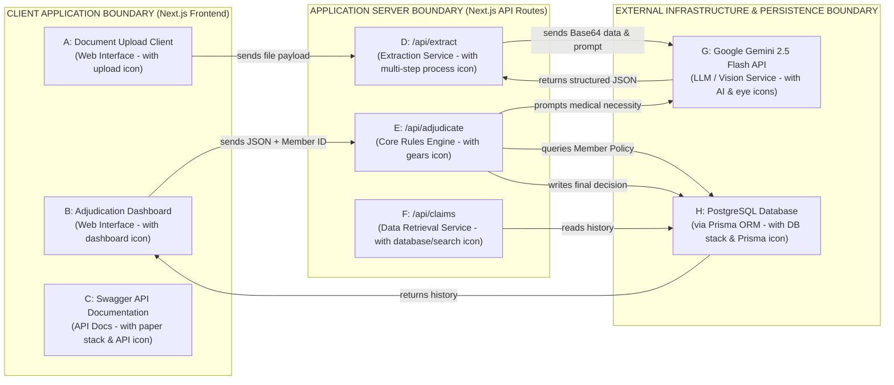

```mermaid
graph LR
    subgraph ClientBoundary["CLIENT APPLICATION BOUNDARY (Next.js Frontend)"]
        direction TB
        A["A: Document Upload Client<br/>(Web Interface - with upload icon)"]
        B["B: Adjudication Dashboard<br/>(Web Interface - with dashboard icon)"]
        C["C: Swagger API Documentation<br/>(API Docs - with paper stack & API icon)"]
    end

    subgraph ServerBoundary["APPLICATION SERVER BOUNDARY (Next.js API Routes)"]
        direction TB
        D["D: /api/extract<br/>(Extraction Service - with multi-step process icon)"]
        E["E: /api/adjudicate<br/>(Core Rules Engine - with gears icon)"]
        F["F: /api/claims<br/>(Data Retrieval Service - with database/search icon)"]
    end

    subgraph ExternalBoundary["EXTERNAL INFRASTRUCTURE & PERSISTENCE BOUNDARY"]
        direction TB
        G["G: Google Gemini 2.5 Flash API<br/>(LLM / Vision Service - with AI & eye icons)"]
        H["H: PostgreSQL Database<br/>(via Prisma ORM - with DB stack & Prisma icon)"]
    end

    A -->|sends file payload| D
    B -->|sends JSON + Member ID| E
    D -->|sends Base64 data & prompt| G
    G -->|returns structured JSON| D
    E -->|prompts medical necessity| G
    E -->|queries Member Policy| H
    E -->|writes final decision| H
    F -->|reads history| H
    H -->|returns history| B
```
