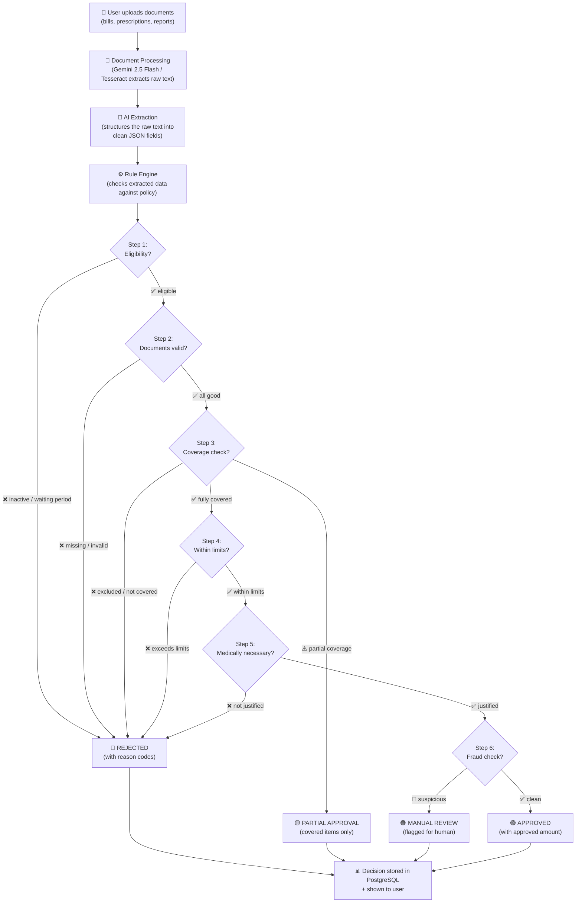

```mermaid
flowchart TD
    A["👤 User uploads documents\n(bills, prescriptions, reports)"] --> B["📄 Document Processing\n(Gemini 2.5 Flash / Tesseract extracts raw text)"]
    B --> C["🤖 AI Extraction\n(structures the raw text into\nclean JSON fields)"]
    C --> D["⚙️ Rule Engine\n(checks extracted data against policy)"]
    
    D --> E{"Step 1:\nEligibility?"}
    E -->|"❌ inactive / waiting period"| R["🔴 REJECTED\n(with reason codes)"]
    E -->|"✅ eligible"| F{"Step 2:\nDocuments valid?"}
    
    F -->|"❌ missing / invalid"| R
    F -->|"✅ all good"| G{"Step 3:\nCoverage check?"}
    
    G -->|"❌ excluded / not covered"| R
    G -->|"⚠️ partial coverage"| P["🟡 PARTIAL APPROVAL\n(covered items only)"]
    G -->|"✅ fully covered"| H{"Step 4:\nWithin limits?"}
    
    H -->|"❌ exceeds limits"| R
    H -->|"✅ within limits"| I{"Step 5:\nMedically necessary?"}
    
    I -->|"❌ not justified"| R
    I -->|"✅ justified"| J{"Step 6:\nFraud check?"}
    
    J -->|"🚩 suspicious"| M["🟠 MANUAL REVIEW\n(flagged for human)"]
    J -->|"✅ clean"| A2["🟢 APPROVED\n(with approved amount)"]
    
    R --> OUT["📊 Decision stored in PostgreSQL\n+ shown to user"]
    P --> OUT
    M --> OUT
    A2 --> OUT
```
