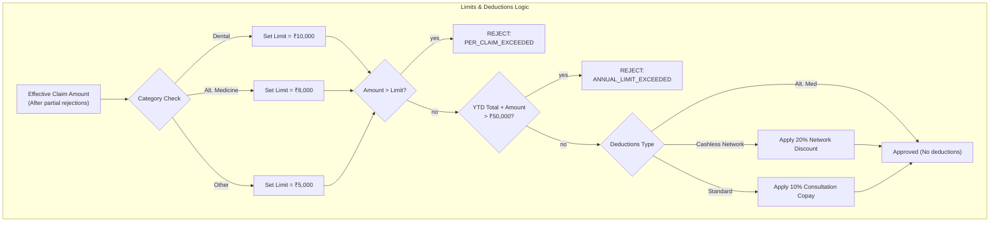

# Co-pay & Amount Calculation Flowchart

## Calculation Steps

1. **Start with the Effective Amount**: This is the total claim amount (or the reduced amount if some items were rejected).
2. **Determine the Applicable Limit**:
   - If the diagnosis or procedures involve **Dental**, the limit is **₹10,000**.
   - If it involves **Alternative Medicine** (Ayurveda, Homeopathy, Unani, Panchakarma), the limit is **₹8,000**.
   - Otherwise, the standard per-claim limit is **₹5,000**.
3. **Check Limits**:
   - Reject if the amount exceeds the applicable limit.
   - Reject if adding this amount exceeds the **₹50,000** annual limit.
4. **Calculate Deductions (Mutually Exclusive)**:
   - **Alternative Medicine**: No copays apply.
   - **Cashless at Network Hospital**: Apply a **20% network discount** on the amount (copay is skipped).
   - **Standard Consultation**: Apply a **10% copay** on the amount if a consultation fee is present.
