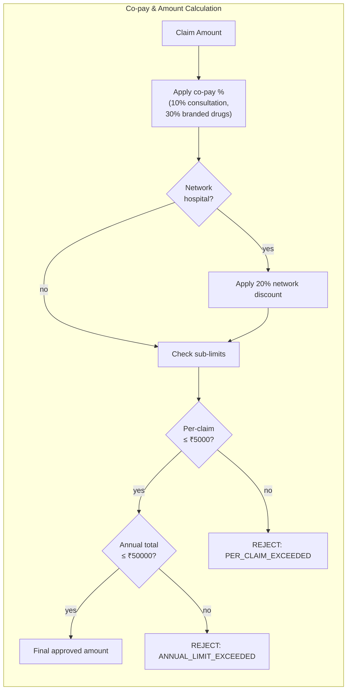

# Co-pay & Amount Calculation Flowchart

## Calculation Steps

1. **Start with the raw claim amount**
2. **Apply co-pay percentages:**
   - consultation fees → 10% co-pay (member pays 10%)
   - branded drugs → 30% co-pay
   - generic drugs → no co-pay
3. **Network discount** (if hospital is in network list): 20% off
4. **Check sub-limits** per category:
   - consultation: ₹2,000
   - diagnostic tests: ₹10,000
   - pharmacy: ₹15,000
   - dental: ₹10,000
   - vision: ₹5,000
   - alternative medicine: ₹8,000
5. **Per-claim cap**: single claim can't exceed ₹5,000
6. **Annual cap**: total claims year-to-date can't exceed ₹50,000
