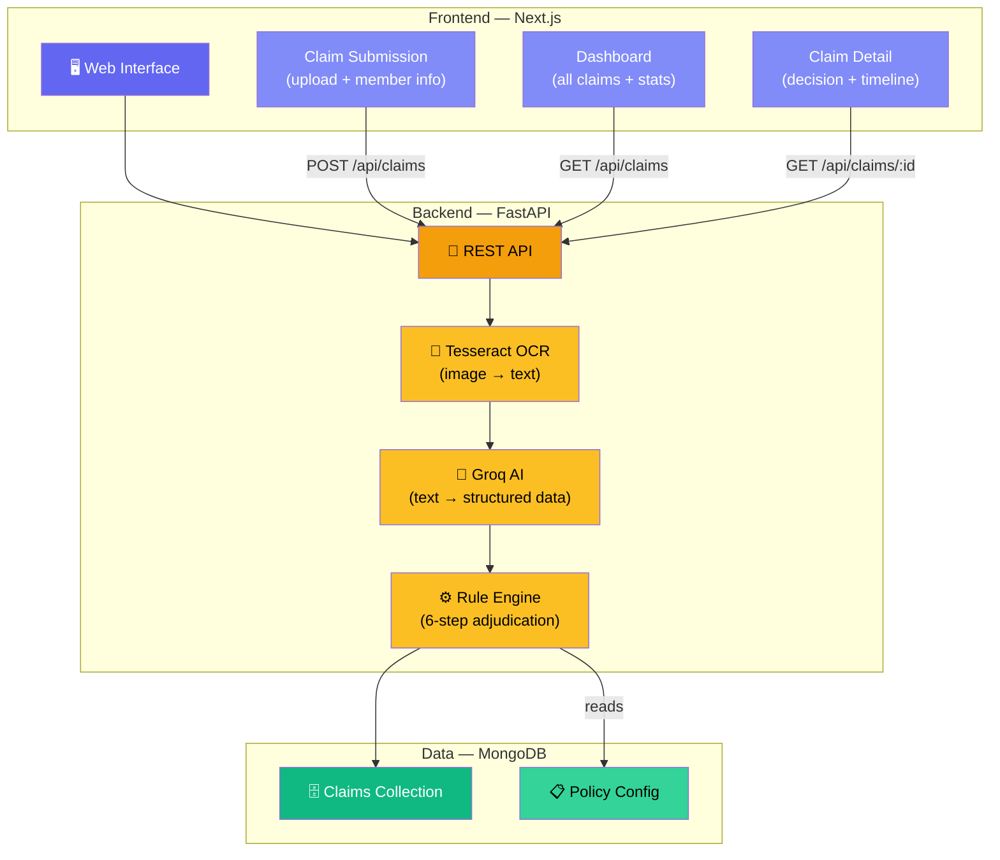

# System Architecture



## API Endpoints

| Method | Endpoint | What it does |
|--------|----------|-------------|
| `POST` | `/api/upload` | upload a document file |
| `POST` | `/api/claims` | submit a new claim (triggers full pipeline) |
| `GET` | `/api/claims` | list all claims |
| `GET` | `/api/claims/{id}` | get one claim with full details |

## Data Flow

```
user fills form + uploads files
        ↓
POST /api/claims (member info + file paths)
        ↓
backend runs tesseract on each file → raw text
        ↓
raw text sent to groq → structured JSON
        ↓
rule engine checks JSON against policy_terms.json
        ↓
decision saved to mongodb
        ↓
response sent back to frontend
```
