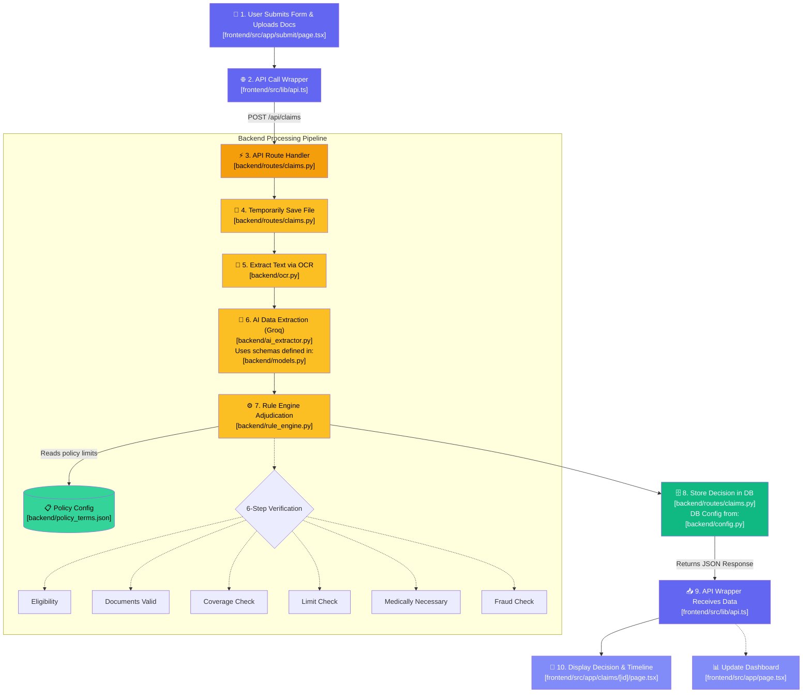

# Full System Flow (With File Mapping)

This document maps the entire journey of a claim through the system, from the moment the user clicks "Submit" until they see the final decision. Crucially, it highlights exactly **which files** in the codebase are responsible for each step.

## Visual Flowchart

## Step-by-Step Breakdown

### 1. Frontend: User Input
- **Where:** `frontend/src/app/submit/page.tsx`
- **What happens:** The user fills out the patient details (name, claim amount, diagnosis) and uploads their medical documents (bills, prescriptions). When they click "Submit", it calls a function to send this data.

### 2. Frontend: API Call
- **Where:** `frontend/src/lib/api.ts`
- **What happens:** This is the centralized API client. It takes the form data and files, creates a `multipart/form-data` request, and sends it to the backend's `POST /api/claims` endpoint.

### 3. Backend: Route Handling
- **Where:** `backend/routes/claims.py`
- **What happens:** The FastAPI server receives the request. The endpoint function for `POST /api/claims` starts orchestrating the entire backend process. It first saves the uploaded files locally to an `uploads/` directory.

### 4. Backend: OCR (Optical Character Recognition)
- **Where:** `backend/ocr.py`
- **What happens:** The route handler passes the saved files to `ocr.py`. This file uses Tesseract to scan the images/PDFs and extract all the raw, unformatted text from them.

### 5. Backend: AI Extraction
- **Where:** `backend/ai_extractor.py` and `backend/models.py`
- **What happens:** The raw text is messy. It's sent to Groq AI via `ai_extractor.py`, which is prompted to extract specific data (e.g., doctor's name, diagnosis, billed amount). It structures this data strictly according to Pydantic data schemas defined in `backend/models.py`.

### 6. Backend: Adjudication Logic
- **Where:** `backend/rule_engine.py` and `backend/policy_terms.json`
- **What happens:** The structured data is handed over to the Rule Engine. This file executes a strict 6-step logic pipeline (Eligibility, Documents, Coverage, Limits, Medical Necessity, Fraud). During this process, it reads from `policy_terms.json` to know the exact coverage limits and exclusions.

### 7. Backend: Database Storage
- **Where:** `backend/routes/claims.py` and `backend/config.py`
- **What happens:** Once the Rule Engine makes a decision (Approved, Rejected, Partial, Manual Review), the result is passed back to the route handler. The route handler connects to MongoDB (using settings from `config.py`) and saves the entire claim record.

### 8. Frontend: Displaying the Output
- **Where:** `frontend/src/app/claims/[id]/page.tsx` and `frontend/src/app/page.tsx`
- **What happens:** The backend responds with the saved claim data. The frontend API wrapper (`api.ts`) resolves, and the user is redirected to the Claim Detail page (`[id]/page.tsx`). Here, the user sees a beautiful breakdown of the decision, the amounts, and a timeline of the verification steps. The Dashboard (`page.tsx`) is also updated to list this new claim.
