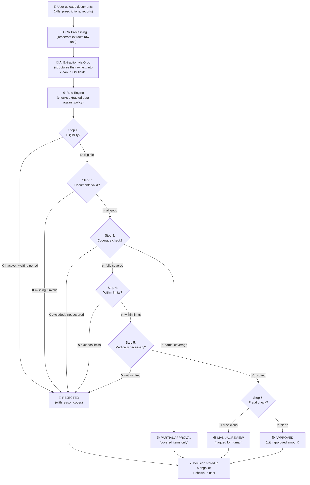

# OPD Claim Adjudication — Workflow Flowchart

## Main Pipeline

## How It Works (Plain English)

1. **User uploads** their medical bills, prescriptions, and reports
2. **Tesseract OCR** reads the images/PDFs and pulls out raw text
3. **Groq AI** takes that messy text and structures it into clean fields (doctor name, diagnosis, amounts, etc.)
4. **Rule Engine** runs 6 checks in order:
   - Is the member eligible? (active policy, waiting period done)
   - Are documents valid? (doctor reg number, dates match, everything readable)
   - Is this treatment covered? (not excluded, not cosmetic, etc.)
   - Is the amount within limits? (per-claim ≤ ₹5000, annual ≤ ₹50000)
   - Is it medically necessary? (diagnosis justifies treatment)
   - Any fraud red flags? (multiple claims same day, suspicious patterns)
5. **Decision** is stored and shown to the user with full reasoning
